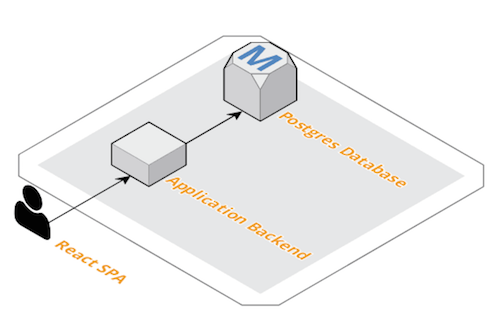

# TechChallengeApp

[![Build Status][circleci-badge]][circleci]
[![Release][release-badge]][release]
[![GoReportCard][report-badge]][report]
[![License][license-badge]][license]

[circleci-badge]: https://circleci.com/gh/servian/TechChallengeApp.svg?style=shield&circle-token=8dfd03c6c2a5dc5555e2f1a84c36e33bc58ad0aa
[circleci]: https://circleci.com/gh/servian/TechChallengeApp
[release-badge]: http://img.shields.io/github/release/servian/TechChallengeApp/all.svg?style=flat
[release]:https://github.com/servian/TechChallengeApp/releases
[report-badge]: https://goreportcard.com/badge/github.com/servian/TechChallengeApp
[report]: https://goreportcard.com/report/github.com/servian/TechChallengeApp
[license-badge]: https://img.shields.io/github/license/servian/TechChallengeApp.svg?style=flat
[license]: https://github.com/servian/TechChallengeApp/license

The Servian tech challenge app is a golang application used for challenging candidates applying to work with Servian.

## Documentation structure

[readme.md](readme.md) - this file
[config.md](config.md) - how to configure the application

### Architecture Design Records (ADR)

Architectural decisions are recorded in the `adr` folder, details on why can be found in the [first entry](adr/0001-record-architecture-decisions.md)

Naming convention: `####-<decision title>` where the first 4 digits are iterated by 1 for each record.

## Tech Challenge Application

Single page application designed to be ran inside a container or on a vm (IaaS) with a postgres database to store data.

It is completely self contained, and should not require any additional dependencies to run.

## Install

1. Download latest binary from release
2. unzip into desired location
3. and you should be good to go

## Database setup

This application is backed by a postgres db. Use the `updatedb` command to create the database, tables, and seed with test data

### Supported versions

Tested against:

* PostgreSQL 9.6
* PostgreSQL 10.7

## Start server

update `conf.toml` with database settings (details on how to configure the application can be found in [config.md](config.md))

`TechChallengeApp updatedb` to create a database, tables, and seed it with test data. Use `-s` to skip creating the database and only create tables and seed data.

`TechChallengeApp serve` will start serving requests

## Interesting endpoints

`/` - root endpoint that will load the SPA

`/api/tasks/` - api endpoint to create, read, update, and delete tasks

`/healthcheck/` - Used to validate the health of the application

## Repository structure

``` sh
.
├── assets      # Asset directory for the application
│   ├── css     # Contains all the css files for the web site
│   ├── images  # Contains all the images for the web site
│   └── js      # Contains all the react javascript files
├── cmd         # Command line UI logic is managed in this location
├── config      # Contains the configuration logic for the application
├── daemon      # Contains the logic of the daemon that runs and control the app
├── db          # Contains the data layer and db connectivity logic
├── doc         # Documentation folder
├── model       # Data model for the application
└── ui          # Web UI, routing, connectivity
```

## Application Architecture



The application itself is a React based single page application (SPA) with an API backend and a postgres database used for data persistence. It's been designed to be completely stateless and will deploy into most types of environments, be it container based or VM based.

## Build from source

Pre-built releases are available so not many people need to look here.

### Requirements

Application currently bundles assets using [go.rice](https://github.com/GeertJohan/go.rice/)

#### Golang

Application is built using golang, this can be installed in many ways, go to [golang](https://golang.org/) to download the version that suits you.

#### Docker

If building using docker you need to have docker installed on your local machine. Download from the [docker website](https://www.docker.com/get-started)

### Compiling the application locally

From the source repo:

run `build.sh` to download all the dependencies and compile the application

the `dist` folder contains the compiled web package

### Docker build using docker

To build a docker image with the application installed on it

`docker build . -t servian/techchallengeapp:latest`


### Pull Image from Dockerhub:

To pull a docker image pre-built

`docker pull servian/techchallengeapp:latest`

## Continuous Integration

Continuous integration is managed through circleci and the build on the master branch will create a new release when a new version is defined.

## Creating a new release

Releases are deployed and managed through github, it's an automated process that is executed through the CI solution

To create a new release, update `../cmd/root.go` with the new version and merge that into the master branch.

The commit message on the merge, will be the release message, so make sure it contains the release notes.

A tag will be created on the master branch if the build and release is successful.

We use semver for versioning, `major.minor.patch[-pre-release]` and the CI solution has been configured to take note of the `-pre-release` tag of the version and upload it as a pre-release in git if it's included. So to release a new full release, make sure to not include `-pre-release` and vice versa.

Builds will be produced for:

* MacOS (amd64)
* Linux (x86/amd64)
* Windows (x86/amd64)

#### Note
* If you are setting up the database using RDS, do not run the `./TechChallengeApp updatedb` command. Instead run `./TechChallengeApp updatedb -s` 
