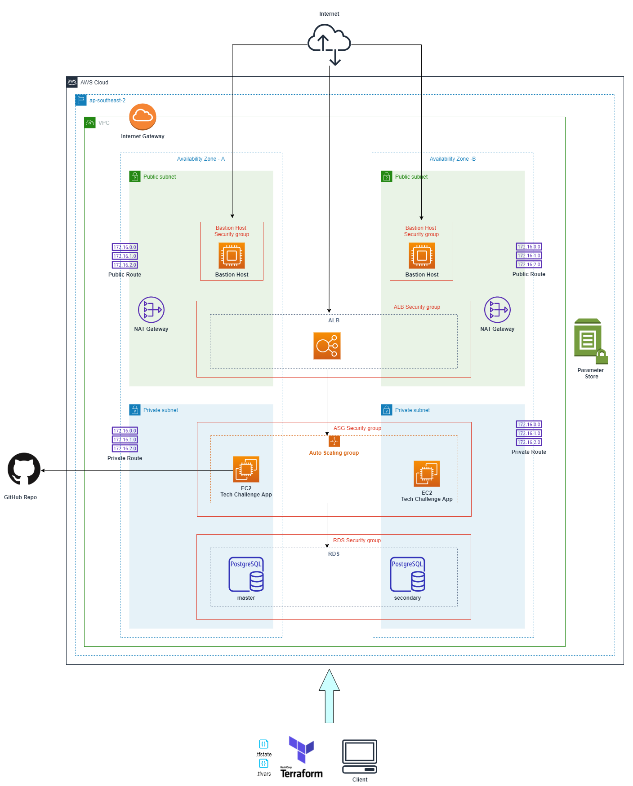

# Infrastructure

This section will guide you to deploy the Tech Challenge app written in Go and Postgres database. The cloud solution chosen for this solution is AWS Cloud. All cloud changes have been made using infrastructure as code implementation using Hashicorp Terraform.

## Architecture

* A user accessing the single page application uses the ELB endpoint.
* While Application Load Balancer and Bastion hosts are public facing, Auto Scaling Group and RDS Postgres are private.
* SSH into application instances are possible only through bastion hosts.
* Database queries can be run on RDS through bastion hosts. Postgres clients are available in those hosts.
* Internet to private resources are provided through NAT Gateway.
* Application binary is downloaded from Servian TechChallenge GitHub and installed.
* AWS SSM Parameter Store service is used to store database credentials for future use. Password is auto generated, hence this need not be passed as input.
* All AWS resources are created using infrastructure as code with Terraform.
*  `.tfvars` and `.tfstate` files are not checked into repository, therefore it will remain in local system.
*  `.tfstate` files are not maintained in S3 to reduce the complexity of the solution, but would be a recommended method if using pipelines. This would secure the `.tfstate` file by encrypting it and also locks enable one user to deploy at a time.

### Security Group rules:
   #### ASG Security Group - Inbound
   | Protocol Type | Port | Source | 
   | ------------- | -----| ------ |
   | TCP        | 3000 | ALB Security Group |
   | SSH | 22 | Bastion Security Group |

   #### ALB Security Group - Inbound
   | Protocol Type | Port | Source | 
   | ------------- | ----- | ------ |
   | TCP        | 80 | 0.0.0.0/0 |

   #### RDS Security Group - Inbound
   | Protocol Type | Port | Source | 
   | ------------- | ----- | ------ |
   | TCP        | 5432 | ASG Security Group |
   | TCP        | 5432 | Bastion Security Group |

   #### Bastion Security Group - Inbound
   | Protocol Type | Port | Source | 
   | ------------- | ----- | ------ |
   | SSH        | 22 | 0.0.0.0/0 |
   | TCP        | 5432 | Bastion Security Group |

   #### All - Outbound
   | Protocol Type | Port | Source | 
   | ------------- | ----- | ------ |
   | All        | ALL | All |

## Pre-requisites

Pre-requisites to deploy the Tech Challenge app to AWS from any operating system requires the following.

* **AWS account:**
  If using free-tier account, please note, not all services are free-tier eligible. NAT Gateway and multi-az RDS incur cost.
* **AWS IAM user:**
  It is preferable to have a user with AdministratorAccess policy, so that you don't have to create a new policy allowing only resources to be created using Terraform.
   IAM user with programmatic access is sufficient to execute this deployment.
* **AWS CLI:**
  This solution has been tested in AWS CLI `version aws-cli/2.2.11`
   [AWS CLI](https://docs.aws.amazon.com/cli/latest/userguide/cli-chap-install.html)

* **Terraform:**
  This solution has been tested using Terraform `version v1.0.1 on windows_amd64`.
   [Terraform CLI](https://learn.hashicorp.com/tutorials/terraform/install-cli)
   [Terraform downloads](https://www.terraform.io/downloads.html)

* This solution can be deployed from any OS as long as the above pre-requisites are met.

## Process Instructions

To provision the deployment solution for the Tech Challenge SPA, please follow the below steps.

1. Let's make sure Terraform is installed correctly by typing in the below command in your system console.
   `terraform version`
   If you can see the version displayed, we are good to go.
2. Similarly, check whether aws cli is available by typing,
   `aws --version`
3. Configure the AWS user, if not done already.
   `aws configure`
   Provide the access key, secret access key and the region to configure your AWS account.
4.  Assuming that you are already in cloned repo of the Tech Challenge solution, change the directory to `infrastructure/environments/default`. This is where all the Terraform root modules are present.
5.  Run the command to initialise the working directory containing Terraform root modules,
    `terraform init`

6. In the same directory create a file `default.tfvars` for Terraform variables. This will contain some of the variables user needs to pass.
   You would provide key-value pair in this file, just like this,
   `aws_region = "ap-southeast-2"`
7. Fill in all the required variables shown in below table,
   | Variables    | Description |
   | ----------- | ----------- |
   | aws_region        | eg: "ap-southeast-2" |
   | environment    | "default" or any other environment name, like prod, dev etc. |
   | db_user | pass a user name, example: postgres |
   | db_name     | pass a database name, example: postgres |
   | app_package_link | [releases](https://github.com/servian/TechChallengeApp/releases/download/v.0.8.0/TechChallengeApp_v.0.8.0_linux64.zip) This is the latest package of the application for which this solution is tested.  |
8. Now, we are good to provision infrastructure and deploy the application. Run,
   `terraform apply -var-file "default.tfvars"`
    It will show you the resources to be created in AWS. When prompted for a response, type `'yes'` to make these changes in your account. Typing anything else would cancel the transaction.
9.  This would take around 10 to 15 minutes to finish as RDS creation takes longer.
10. Once completed, you can copy the ALB link from the terminal output, `"servian_tech_challenge_app_endpoint"`.
11. Copy and paste this link in to a browser, you will see the Servian application running. Now you can add and delete tasks in the UI.
12. Alternatively, you can login to your AWS console, and verify all the resources are created.
13. Now, to destroy all the resources, run below command,
    `terraform destroy -var-file "default.tfvars"`
    Response `'yes'` for a prompt to delete them all.
    It would take few minutes to delete all the resources. 
