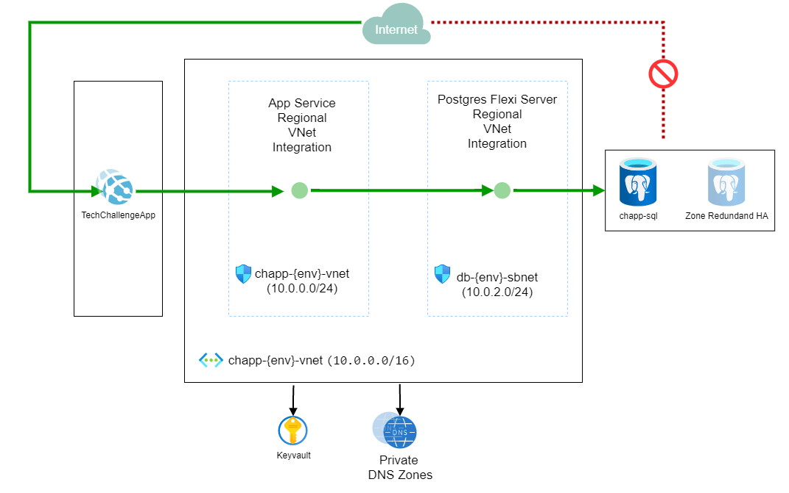

# Project Servian Technical Challenge

This repo contains a sample showcasing a basic implementation for the Servian DevOps Tech challenge using the Azure Cloud services. 
The implementation contains patterns and best practice where possible to illustrate concepts and ideas but there are shortcuts and simplifications. This repository should not be taken as production quality but can serve as a scaffold for future work.
If you want to read more about the challenge see [here](./doc/servian.md).

The sample shows:

- managing and deployment using Terraform
- secret management using Key Vault and keyvault integration with app service
- networking lockdown using Azure App Service with VNET integrations
- database access using Postgres Flexi
- github workflows to deploy infrastructure, database seeding and application deployment ci

## Contents

| File/folder        | Description                                       |
|--------------------|---------------------------------------------------|
| `src`              | Sample source code for the application.           |
| `.github\workflows`| Github action deployment scripts.                 |
| `doc`              | Technical writeups.                               |
| `env`              | Terraform deployment content.                     |
| `.gitignore`       | Define what to ignore at commit time.             |
| `README.md`        | This README file.                                 |
| `LICENSE`          | The license for the sample.                       |

## Scenario

The application is a To-do management list. At the core of the solution is an application ui with a backing api. This api stores the to-do items in a Postgres highly available database.

## Solution Architecture

The following diagram represents the architecture of the solution.

## Security

The To-do application is locked down to only be accessible at a network level from other systems in the same vnet. This is a great feature of a secure environment with secure network isolation of critical resources. However, there is a trade-off which has to be carefully pondered in the design stage; Secure network isolation vs remote access to these resources. An isolated network can certainly complicate remote access to any of the resources inside it, particularly for simple tasks such as direct access to the database.

Application machine curated secrets, such as credentials and connection strings are stored in an Azure Keyvault. These secrets required by the application are seamlessly integrated using a keyault reference in the application configuration. In this way, this the secret itself is not exposed, it is only referenced and cached by azure when it is required.

There is an application change to support a safe transport configuration to require ssl connections between application and database server.

## Database

The Postgres Flexi server PaaS option in azure offers high availaibity and vnet integration and zone redundant high availability.
In this sample, the seeding of the database is done via the application, which is is a similar approach when using ORM solutions that seed and manage changes to the database schema via code. Another approach is to use a build hosted agent that is part of or can be routed to this vnet. There are many ways to achieve this in a secure isolated environment.
In the ideal scenario, the database chanage management is source controlled, versioned, and treated just as any other solution component that forms our release candidate, so a hosted agent that is whitelisted and can route to the application network would be a more real world scenario.

## Distributed Telemetry

Telemetry should be captured all across the tech stack. In Azure the recommended option for applications is AppInsights. To enable telemetry capture in this solution the [appinsights sdk](https://github.com/microsoft/ApplicationInsights-Go) needs to be added configured in the api and ui. To limit the scope of this sample and work required it has been left out. Telemetry shares a common operation id, allowing correlation of distributed components across the stack.

## Deployment

The solution infrastructure is deployed using Terraform. The terraform templates and code is available in the `/env` folder. The [readme](./env/readme.md) explains how to deploy the environment into your own Azure subscription. The infrastructure deployment can be deployed manually or using Github Actions included in this repository.
There is a cicd deployment pipeline that would build the docker image and tag it and deploy to the ci environment.

## Improvements made to the application
- Changed healthcheck endpoint status to 500-level response on failure. Architectural decision details [here](doc/adr/0007-healhcheck-error-returns-failed-status.md).
- Application database connection string changed to use `sslmode=require`. In this way communications are encrypted.

## Future improvements
- Enable distributed telemetry using App Insights by adding appinsights library for GO to the application
- Remove admin user for connection string, but needed for seeding
- API Traffic could be restricted from public access if required
- Keyvault could be put inside the vnet (keyvault integration with app service would stop working as current azure limitation)
- Could add Traffic management resource for improved traffic management. Currently using App service built in load balancer to handle horizaontal scaling.
- Use of deployment slot for a blue/green type deployment